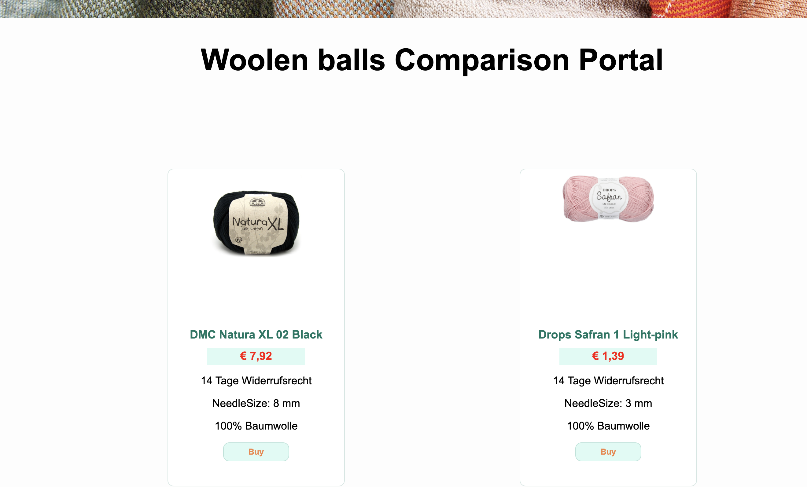

# Software-Challenge - wollComparator

## Description
A friend's grandmother regularly knits socks. But she spends way too much money on
wool at the craft shop next door. Therefore, you want to programme a comparison

portal for her (and all knitting grannies). The portal should display wool-knitting infor-
mation from different websites.

To do so, you want to start by automatically reading information from a first website,
the “Wollplatz1

“. You are interested in the price, the delivery time, the needle size and

the composition.
You have selected the following billets for which you want to have the information2
:

After starting the project, you are planning big things for your wool comparison portal.
Accordingly, you are already thinking about how you can capsulate the code on this
first website so that you can add more websites and functionalities later.
For the time being, however, you only want to save the data as a file in a simple,
practical format.

Brand       Name
DMC         Natura XL
Drops       Safran
Drops       Baby Merino Mix
Hahn        Alpacca Speciale
Stylecraft  Special double knit

## Requirements

### Technical
- Programming language: Python

### Functional
The listed woolen balls are automatically searched for on the website using the brand
and name.
If available, the following information is stored in a file for each of the listed woolen
balls: <br/>
▪ Price <br/>
▪ Delivery time <br/>
▪ Needle size  <br/>
▪ Composition

### Non-functional
Create a few tests to verify the functional requirement.
Your code should be solid.
Use tools commonly used for software development, especially for larger projects.

Additional information
The challenge should be completed in 2-3 hours. If you need to read up on one or the
other topic, maybe a bit longer. In any case, please let us know how much time you
have spent.

The challenge is intentionally formulated openly so that you could also put in consid-
erably more time. If you have an idea that you think is important but too extensive for

this challenge, you can write it down for us in comments, a readme or similar.
Bonus: If you want to invest more time, you can also try to save the information not
only in a file, but e.g., also store it in a database or display it in the browser. For this,
please select any technologies that are convenient for you.

## Work With the Repo
If you want to analyse the work done you should first start by cloning the repo. You can do it by following these steps:
 - Open the terminal and copy this command:
 ````
 git clone git@github.com:Anvi98/wollComparator.git
 ````  
 - Next:
 ````
 cd wollComparator
 ````
 - Before Doing this project has some dependencies, they are: BeautifulSoup4, lxml and requests of course python too.

 First if you don't have already these dependencies installed, follow with me. Normally I should have done everything inside virtual_env to make it easy :-) :

 ````
 pip install beautifulsoup4
 ````
 after the first installation, in your terminal again copy this and press enter:
 ````
 pip install lxml
 ````
 The last one: 
 ````
 pip install requests
 ````
 
 Now we're ready to move ooff !!

 if after cloning the repo you open the comparator.html file, you should have a page where there is no item displayed, a similar picture like this:
 
 
 What we have to do is to open our terminal, make sure our current location is inside de folder cloned then press this command:
 `````
 python3 main.py
 `````
 or
  `````
 python main.py
 `````

 After the running this command, a JSON file will be created, then if we go back again to check our website, we can see now some items displayed. They come from:  https://www.wollplatz.de/

 

 If we're able to see those new items, that means, everything went well.

